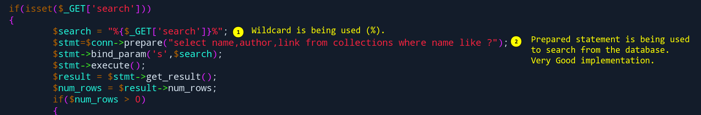
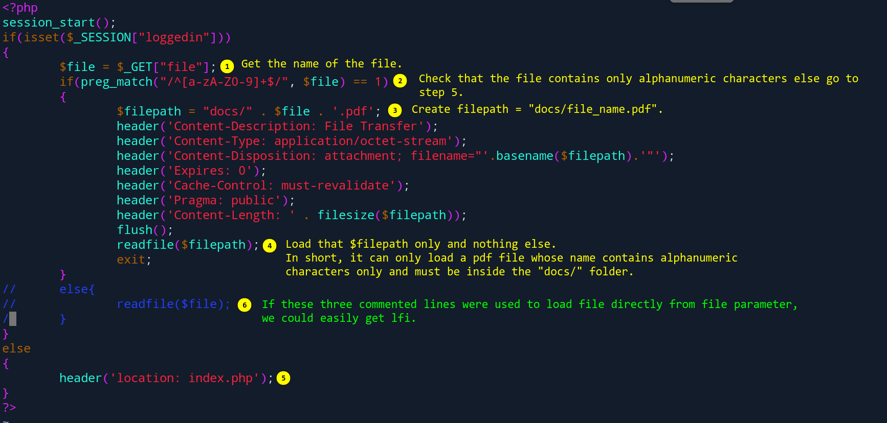
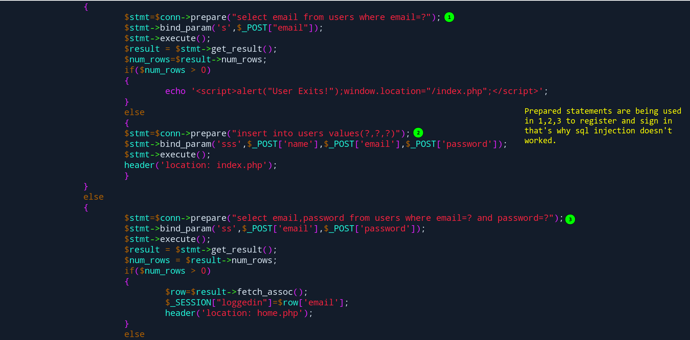
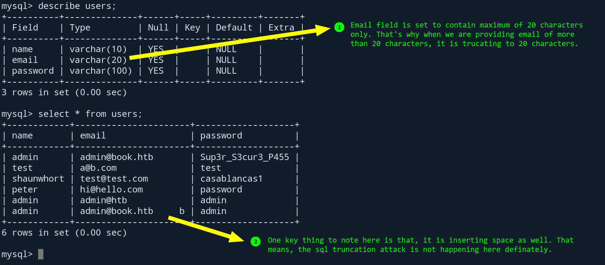
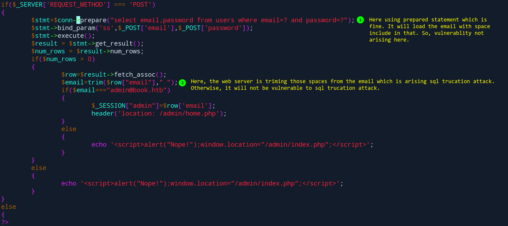
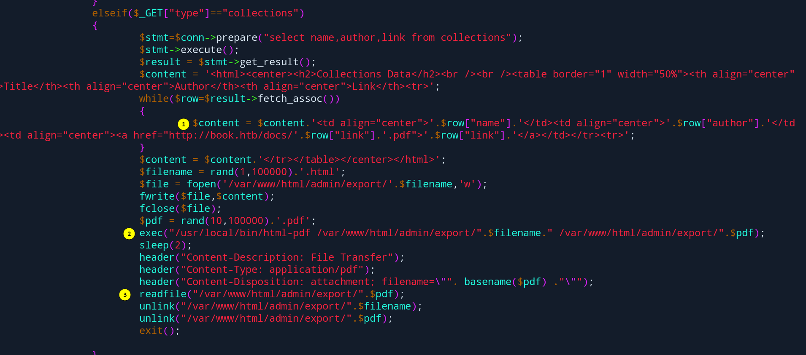

# Questions

1. Why does search.php?search=" not vulnerable to sql injection???
2. Why does download.php?file=1 not vulnerable to lfi???
3. Why does signin and signup functionality not vulnerable to sql injection???
4. Why does signup and signin functionality vulnerable to sql trucation attack???
5. Why does `admin/collections.php?type=collections` executing javascript and html???

## Answers

1. ⬇️
2. ⬇️
3. ⬇️
4. ⬇️

   

   🚀️

   
5. It was intentional 😆
