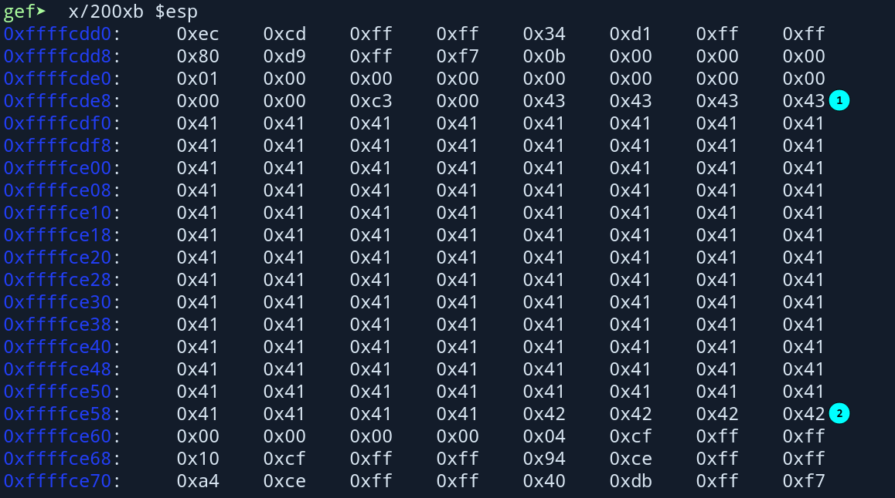

# october : `10.10.10.16`

**Table Of Contents:**

<!-- TOC -->

- [october : `10.10.10.16`](#october--10101016)
  - [Credentials](#credentials)
  - [Synopsis](#synopsis)
  - [Enumeration](#enumeration)
    - [Opened Ports](#opened-ports)
  - [FootHold](#foothold)
  - [Lateral Movement](#lateral-movement)
  - [Privilege Escalation](#privilege-escalation)

<!-- /TOC -->

## Credentials


| Service | Username |       Password       |
| :-------: | :--------: | :--------------------: |
|  http  |  admin  |        admin        |
|  mysql  | october | OctoberCMSPassword!! |

---

## Synopsis

---

## Enumeration

### Opened Ports

- [ ] 22 (SSH)
- [ ] 80 (HTTP)

---

## FootHold

- October CMS is found on the server.
- Default creds of administrator were used. `admin:admin`
- Upload a reverse shell from this page. `http://10.10.10.16/backend/cms/media`
- Now got `www-data`
-

---

## Lateral Movement

- Extracted hash of harry from mysql database which is a valid user on the box.
  ```bash
  mysql> select first_name , email, password, is_activated , is_superuser from backend_users;
  +------------+-------------------+--------------------------------------------------------------+--------------+--------------+
  | first_name | email             | password                                                     | is_activated | is_superuser |
  +------------+-------------------+--------------------------------------------------------------+--------------+--------------+
  | Harry      | harry@october.htb | $2y$10$4tBYxIpkBpR9.coxVUdeJetCp77EFLp1U2o/f2.wlKaBbe698aIzO |            1 |            1 |
  | Admin      | admin@october.htb | $2y$10$ozRr2QHKXLJXx/n.rhQO6.2PxEeNXywYozigkq5NrH7TRBLzqrzUG |            0 |            0 |
  +------------+-------------------+--------------------------------------------------------------+--------------+--------------+
  ```
- Unknown suid binary found `/usr/local/bin/ovrflw`

---

## Privilege Escalation




---
