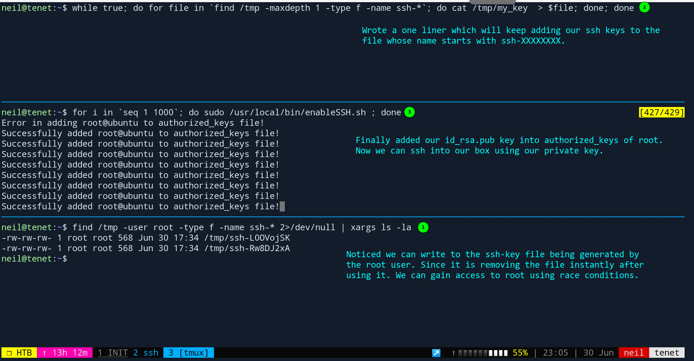

# tenet : `10.10.10.223`

**Table Of Contents:**

<!-- TOC -->

- [tenet : `10.10.10.223`](#tenet--101010223)
  - [Credentials](#credentials)
  - [Synopsis](#synopsis)
  - [Enumeration](#enumeration)
    - [Opened Ports](#opened-ports)
  - [FootHold](#foothold)
  - [Lateral Movement](#lateral-movement)
  - [Privilege Escalation](#privilege-escalation)

<!-- /TOC -->

## Credentials

|  Service  |  Username  | Password |
| :---------: | :-----------: | :---------: |
|   mysql   |    neil    | Opera2112 |
| wordpress | protagonist |           |

---

## Synopsis

PHP deserialization vulnerability in the sator.php file leads us to www-data user. Extract database credential from wp-config.php file got access to user neil. User neil can run a shell script executable file with sudo. Using race condition, got root access on the server.

---

## Enumeration

### Opened Ports

- [ ] 22 (SSH)
- [ ] 80 (HTTP)

---

## FootHold

- Going over to port 80, we saw default index.html page of apache server.
- Gobuster reveals a directory wordpress and it redirected us to `tenet.htb`.
- There was a post of migration in which neil user was talking about `sator.php` file and its backup `sator.php.bak` in the comments.
- We analyze sator.php.bak code and finds out php deserialization vulnerability is there.
- Wrote a small exploit script `exploit.php` to gain access to `www-data` user.

---

## Lateral Movement

- `wp-config.php` file containing database password of user neil. Checking that password for reuse, we got user neil via ssh.

---

## Privilege Escalation

- Find out that user neil can run a script with sudo privileges.
- Race condition to gain access to root.
- 

---
